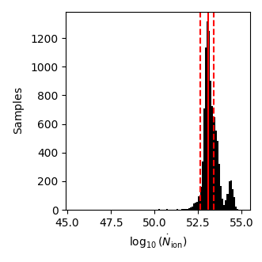

# PHOTONIOn
Implicit Likelihood Inference package trained on mock observations from the SPHINX simulation ([Rosdahl+22](https://ui.adsabs.harvard.edu/abs/2022MNRAS.515.2386R/abstract); [Katz+23](https://ui.adsabs.harvard.edu/abs/2023OJAp....6E..44K/abstract)) to infer the global escaped ionising luminosity of high-z galaxies

While the methodology is described, tested and applied in [Choustikov+24](https://ui.adsabs.harvard.edu/abs/2024arXiv240509720C/abstract), our implementation of ILI is based around the [LTU-ILI package](https://github.com/maho3/ltu-ili/tree/main), described in [Ho+24](https://ui.adsabs.harvard.edu/abs/2024OJAp....7E..54H/abstract).

## Installation
Here are some basic installation instructions to get you started:
```bash
# install the package
git clone git@github.com:Chousti/photonion.git

# create a python environment
cd photonion
mkdir photo-env
source photo-env/bin/activate

# Install the LTU-ILI package (see https://github.com/maho3/ltu-ili/tree/main)
python3 -m pip install -e git+https://github.com/maho3/ltu-ili#egg=ltu-ili

# Finally, install the cloned package
python3 -m pip install -e .
```

## Example Usage
Here's an easy example of how to use the package to infer $\dot{N}_{\rm ion}$ from photometry in JADES bands:
```python
# Example for GN-z11:
# Raw Data: ["F090W", "F115W", "F150W", "F200W", "F277W", "F335M", "F356W", "F410M", "F444W", "z"], shape: (10, N_galaxy)

# Import packages
import photonion 
import numpy as np

# Load model in directory "models"
SBIRegressor = photonion.SBIRegressor.from_config("models", "SBI_JADES_nion")

# Get raw data (Bunker+23; Tacchella+23)
GN_z11 = np.array([[-2.9, 1.2, 115.9, 144.4, 121.7, 132.9, 123.5, 114.9, 133.8, 10.6]]).T 

# Convert data into used features (Choustikov+24)
# these include all magnitudes normalised by apparent UV mag,
# three photometric colours (F115W-F150W, F150W-F277W, F277W-F444W), apparent UV mag, and redshift
Feature_data = photonion.convert_observational_data(GN_z11)

# run pipeline, return a summery of the sampled posterior, and print the output
Nion = SBIRegressor.sample_summarized(Feature_data, n_samples=10000) 
print(f'GN-z11: {Nion[0][0]:.3f}+{(Nion[0][1]-Nion[0][0]):.3f}-{(Nion[0][0]-Nion[0][2]):.3f}')
```
Which would return:
```
\dot{N}_{ion} Prediction for GN-z11: 53.045+0.331-0.605
```
We can also plot the original samples:
```python
# Compute the rawsamples
vals = SBIRegressor.sample(Feature_data, n_samples=10000)

# Make plot
f, axs = plt.subplots(1,1,figsize=(3.31,3.31),sharex=True,sharey=True)
plt.subplots_adjust(left=0.17, right=0.85, top=0.95, bottom=0.15)

axs.hist(vals[0], bins=100, color='k')

# Add summarized samples
axs.axvline(Nion[0][0], color='r')
axs.axvline(Nion[0][1], color='r', ls='--')
axs.axvline(Nion[0][2], color='r', ls='--')
axs.set_xlabel(r'$\log_{10}(\dot{N}_{\rm ion})$')
axs.set_ylabel(r'$\rm Samples$')
```


For transparency, we also include all of the code to train ILI models as well as to optimize their hyperparameters. We do not recommend that these are used out of the box, and have therefore not documented them fully.
If you are interested in using a framework like this to train ILI models to infer physical quantities as trained on SPHINX galaxies, please reach out. We would be very happy to help and collaborate.
## Citation
If you use this package for anything cool, a citation of the original paper should be included:
````bibtex
@ARTICLE{2024arXiv240509720C,
       author = {{Choustikov}, Nicholas and {Stiskalek}, Richard and {Saxena}, Aayush and {Katz}, Harley and {Devriendt}, Julien and {Slyz}, Adrianne},
        title = "{Inferring the Ionizing Photon Contributions of High-Redshift Galaxies to Reionization with JWST NIRCam Photometry}",
      journal = {arXiv e-prints},
     keywords = {Astrophysics - Astrophysics of Galaxies, Astrophysics - Cosmology and Nongalactic Astrophysics},
         year = 2024,
        month = may,
          eid = {arXiv:2405.09720},
        pages = {arXiv:2405.09720},
          doi = {10.48550/arXiv.2405.09720},
archivePrefix = {arXiv},
       eprint = {2405.09720},
 primaryClass = {astro-ph.GA},
       adsurl = {https://ui.adsabs.harvard.edu/abs/2024arXiv240509720C},
      adsnote = {Provided by the SAO/NASA Astrophysics Data System}
}
````

## Data
- [SPHINX Data Release paper](https://ui.adsabs.harvard.edu/abs/2023OJAp....6E..44K/abstract)
- [SPHINX data](https://github.com/HarleyKatz/SPHINX-20-data)
